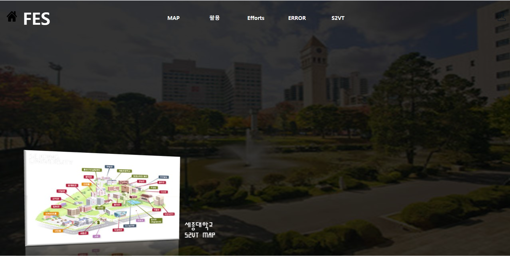
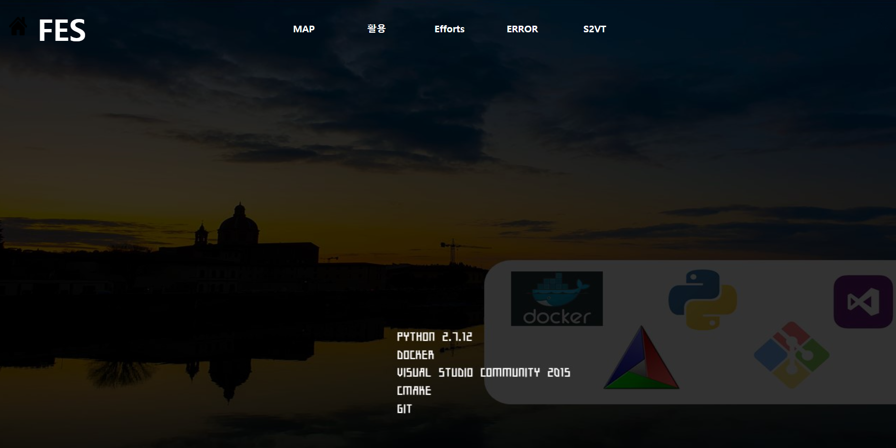
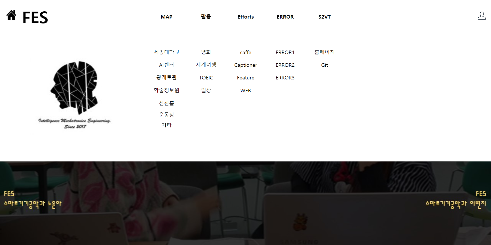
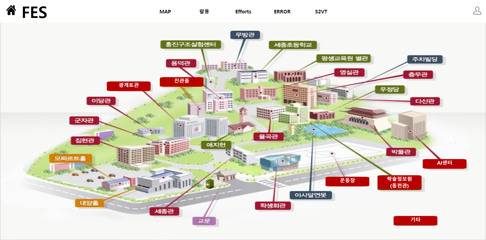
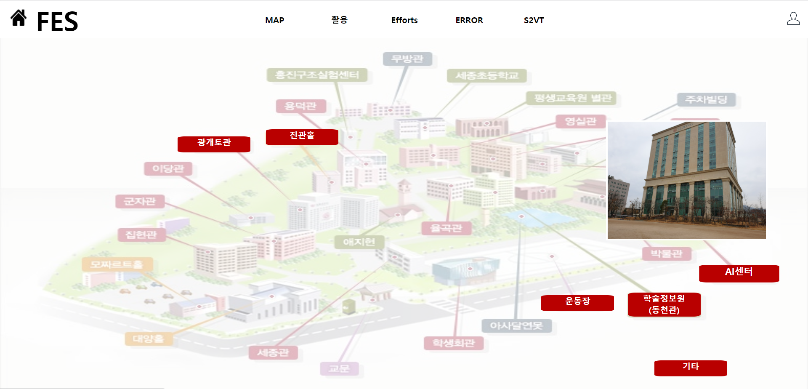
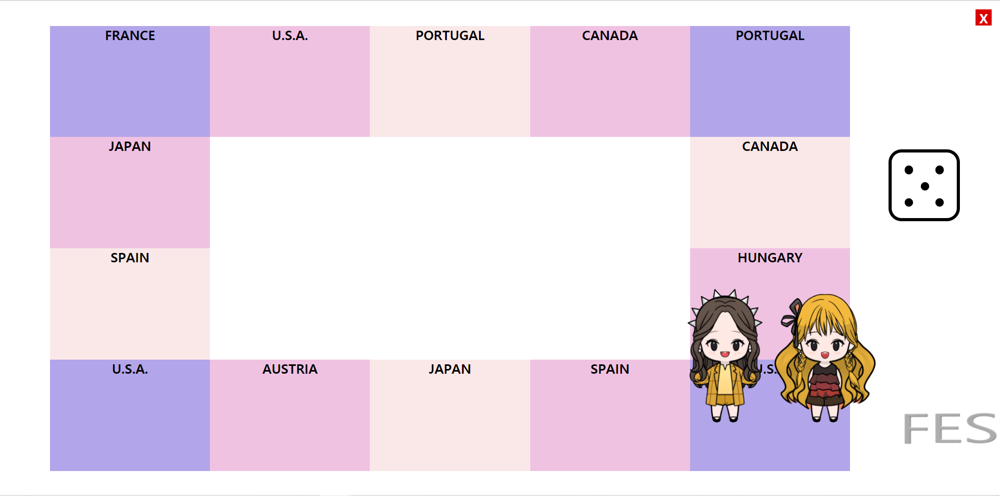
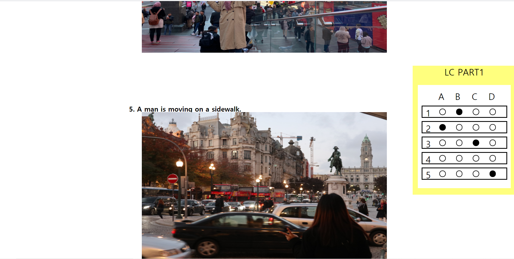
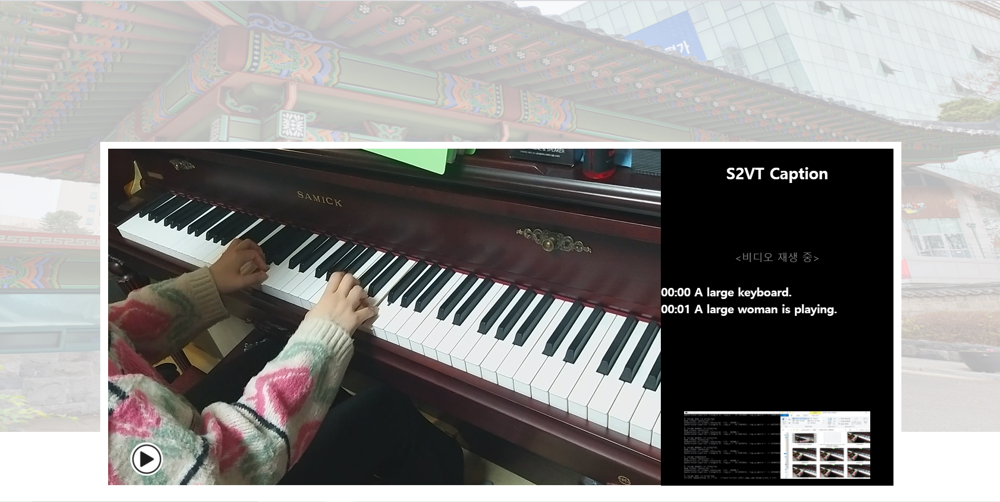

# 2020 Castone Design
### [Team FES]

2020 가을학기 캡스톤 디자인 주제로 Video Captioning 기술을 활용한 웹사이트 제작을 진행하였습니다.

* Caffe

* Visual Studio Community 2015

* Python 2.7.12

* numpy / scipy / matplotlib / scikit-image / protobuf

* CMake 3.6.0

* Docker

* git bash

***

### 1. 프로젝트 목표

다양한 화질의 비디오 혹은 정지영상들을 입력 받아 분석한 뒤, 분석정보들을 문장으로 출력한 후 웹페이지를 제작하여 결과물을 출력합니다.

### 2. 관련 이론 및 실습 교과목

고급 C프로그래밍 및 실습, 고급 프로그래밍 입문-p, 자료구조 및 실습, 인공지능, 영상처리, 웹 프로그래밍

### 3. 프로젝트 내용

* Sequence to Sequence - Video to Text 논문과 관련 코드를 참고하여 진행하였습니다.

* 이 논문에서는 비디오 캡션을 생성하는 새로운 end-to-end sequence-to-sequence 모델로 이미지 캡션 생성에서 좋은 성능을 보이는 recurrent nural networks, 특히 LSTM을 활용합니다.

* LSTM 모델은 비디오-문장 쌍에 대해 훈련되고 비디오에서의 사건에 대한 설명을 생성하기 위해 비디오 프레임 sequence를 단어 sequence에 연결하는 방법을 학습합니다.

* 저희는 S2VT 모델을 이용하여, 다양한 길이의 영상을 넣으면 해당 상황에 따라 짧은 단어가 아닌 자연스러운 "문장" 형식으로 Video Caption을 생성하도록 하였습니다.

* 세종대학교 소개, 여행 사진 captioning, 영화 자막 생성, TOEIC Listening 영어 문제 등 다양한 방면에서 활용 가능한 예시를 웹을 통해 데모할 수 있도록 하였습니다.

### 4. 기존 프로젝트와의 차별점

* AI를 활용하여 세종대학교 캠퍼스를 소개하는 사이트을 제작하였습니다.

* 기존의 많은 캡셔닝 서비스의 경우 긴 문장이 아닌 짧은 단어로 표현되는 경우가 많습니다

* 부루마블 게임에서 주사위를 던져 나온 국가에서의 여행 사진에 대한 Caption을 나타내었습니다.

* 사진에 대한 설명을 음성으로 출력함으로써 TOEIC Listening/ Speaking 시험에 대비하여 공부할 수 있습니다.

* 국내 영화의 비디오 장면을 영어 문장과 음성으로 출력하도록 시도하였습니다.

### 5. 프로젝트 진행 환경 및 일정

Windows 10 환경에서 언어는 python 2.7.12와 C++ 등을 사용하였고, 사용된 딥러닝 프레임워크는 Caffe입니다.

Caffe는 파이썬 인터페이스에서 이미지 처리에 매우 적합한 프레임워크로, 저희는 CPU 환경에서 모든 과정을 진행하였습니다.

##### [4개월 간 진행했던 개발 일정은 아래와 같습니다.]

* 9월 : S2VT 모델 이해 및 논문과 AI 개념 공부

* 10월 : 논문 기반 소스코드 이해 및 수정 & 구현

* 11월 : 학교 영상 데이터 촬용 후 video에서 feature 추출

* 12월 : 사용자 인터페이스로 웹 제작

### 6. 프로젝트 진행 과정

* Windows 10환경에 Caffe. Visual Studio 2015, CMake 설치

* 논문의 S2VT Caffe 모델 다운 및 코드 수정

* 전처리 된 caffemodel, S2VT Vocabulary 준비

* 촬영한 비디오에서 frame당 feature 추출

* VGG-16을 이용해서 추출한 feature을 넣어 caption을 생성

* 입력 영상에 대한 결과물을 웹으로 데모 (HTML / CSS / Javascript)

***

# 프로젝트 최종 결과물

Web main화면

menu를 통해 S2VT Video Captioning의 다양한 활용들을 볼 수 있습니다.

### 활용 1. 학교 소개

세종대학교에 처음 오는 새내기 학생들이나 외국인 학생들, 시각장애인들에게 세종대학교의 건물들과 학교에서 할 수 있는 활동들을 소개할 수 있도록, 학교 내에서 찍은 다양한 영상들을 첨부하여 동영상 재생 시 캡션과 음성이 출력되도록 설계하였습니다. 또한 오른쪽 아래의 작은 이미지에 마우스를 대면 S2VT의 캡션이 생성된 해당 프레임과 캡션 생성 과정을 볼 수 있도록 구성하였습니다.

### 활용 2. 영화 자막 생성

Video to Text 기술을 활용하여 영화 재생 시 자막과 음성이 함께 출력되도록 하여 시각장애인들이 영화나 공연, 다양한 영상들을 시청하는데 도움이 되도록 구현하였습니다.

### 활용 3. 여행 사진 캡션 생성

S2VT를 재밌게 활용할 수 있는 방안으로 여행에서 직접 찍은 이미지를 첨부하여 부루마블 형식의 게임으로 만들었습니다. 주사위를 던지면 1~6의 랜덤 값이 나오고, 캐릭터가 해당 칸에 이동한 뒤 여행 사진과 캡션, 음성이 함께 출력되도록 하였습니다. (발표 영상에서는 다양한 캡션 출력을 위해 해당 칸 클릭시에도 사진과 캡션이 나타나도록 하였습니다.)

### 활용 4. 언어 공부에 활용

토익 Listening Part1이나 Speaking 연습에 활용할 수 있도록 해당 문항의 이미지를 클릭하면 정답 마킹과 함께 사진 속 내용을 설명하는 캡션과 음성이 출력되도록 하였습니다. 이처럼 Video to Text기술을 활용하면 다양한 언어 공부에도 활용할 수 있을 것으로 기대됩니다.

### 활용 5. 영상 편집에 활용

마지막으로, 피아노를 치는 영상, 기타를 연주하는 영상처럼 일상에서 찍은 다양한 영상들을 첨부하여 해당 영상의 캡션과 음성이 출력되도록 하였고, 학교 소개 부분처럼 S2VT 캡션 생성 과정에 대한 이미지도 함께 첨부하였습니다. 이처럼, 영상 편집을 할 때 Video to text 기술을 활용하면 좀 더 쉽게 영상을 생성하는 자막을 첨부할 수 있을 것입니다. 또한, 현재 일상 생활에서 시각장애인들이 사진을 찍어 캡션을 생성할 때 사용하는 앱들이 많이 있는데, 위와 같은 활용방안으로 사진 뿐만이 아닌 동영상 자막 생성에 활용하면 큰 도움이 될 것으로 기대됩니다.

***

### 2020 Capstone Design 발표 및 시연 영상(노윤아,이현지)

<https://www.youtube.com/watch?v=URbBxMFpzMo&t=21s>

***

### 참고 논문 및 코드

<https://vsubhashini.github.io/s2vt.html>

<https://github.com/vsubhashini/caffe/tree/recurrent/examples/s2vt>
